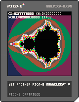

# My Pico-8 collection

Some more educational Pico-8 experiments can be found here.

## Usage

1. Visit [PICO-8 Education Edition](https://www.pico-8-edu.com/).
1. Run the PICO-8 in your browser
1. Drag and Drop a \*.p8 or \*.p8.png onto the running PICO-8
1. Type `run`

## Sample Cartridge

