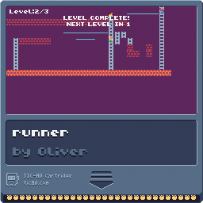

# TIC80 and Pico-8 collection

## My Pico-8 collection

Some more educational Pico-8 experiments can be found here.

### Run Pico-8

1. Visit [PICO-8 Education Edition](https://www.pico-8-edu.com/)
1. Run the PICO-8 in your browser
1. Drag and Drop a \*.p8 or \*.p8.png onto the running PICO-8
1. Type `run`

### Pico-8 Cartridges


## My TIC-80 collection

And some more educational TIC-80 cartridges.

### Run TIC-80

1. Visit [nesbox/TIC-80](https://github.com/nesbox/TIC-80) or a valid fork of the repository like [OMerkel/TIC-80](https://github.com/OMerkel/TIC-80)
1. Get an up-to-date release of the TIC-80 matching your preferred OS or environment
1. Run the TIC80

```powershell
tic80.exe --fs "C:\path\to\target-directory"
```

Set `--fs` to the directory that should be used by TIC-80's `load`, `save`,
`export`, and `import` commands. For example, to open the mandelbrot cartridge when you start the TIC80 from within the mandelbrot directory (assumed you path is set correctly):

```powershell
tic80.exe --fs .
```

Then from cli in the TIC-80 load and run the cartridge:

```text
load mandelbrot.tic
run
```

### Screenshots



