# Software Architecture — TIC-80 Runner

Companion document to [requirements.md](requirements.md). Describes the structure of
`runner.lua` as implemented: a single TIC-80 cart driven by the `TIC()` callback, with
gameplay split into a level/tile layer, shared entity physics, and per-feature systems
(digging, guards, collision) orchestrated once per frame.

## 1. Architectural Overview

The cart has no external modules (TIC-80 constraint, see NFR-8.1/NFR-8.5). Internally it is
organized into layers by responsibility, all within one file:

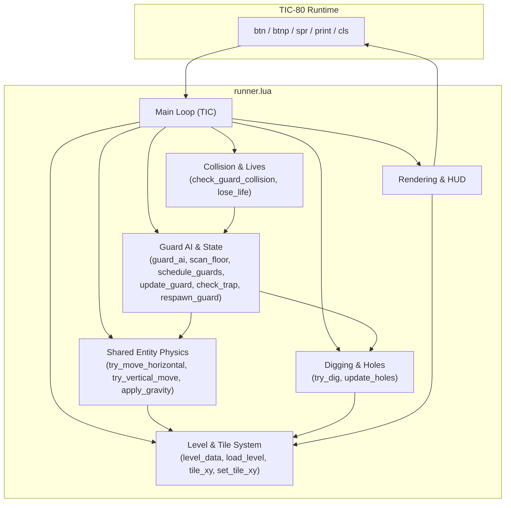

Key design decision: **runner and guards share the same physics functions** (`try_move_horizontal`,
`try_vertical_move`, `apply_gravity`), parameterized by a generic *entity* table and boolean
directional inputs. The runner supplies real button state; guards supply AI-derived intent
(`guard_ai`). This satisfies NFR-2.2 and NFR-4.1/4.2 and avoids duplicated movement code.

Guards differ from the runner in one respect: they do not move on a fixed tick divisor but
only when `schedule_guards` grants them a step from a shared budget. Section 4 covers the
guard AI and its scheduler in full.

## 2. Data Model (Class / Entity Diagram)

Entities are plain Lua tables, not OOP classes (no metatables needed at this scope). The
diagram below models them as classes for clarity.

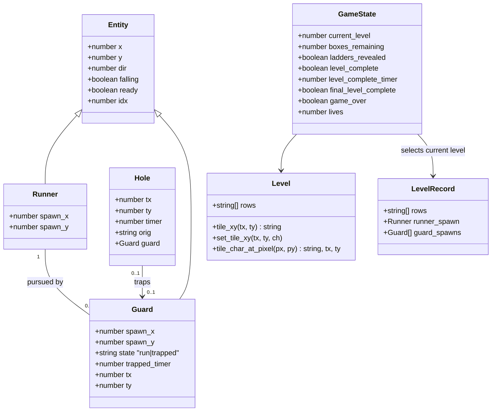

Each entry in `level_data` is a `LevelRecord` containing the tile rows, one runner spawn
table, and a configurable guard spawn list. `load_level(level_index)` binds those records
to the active `level`, `runner`, and `guards` tables and resets level-local mutable state.

## 3. Guard State Machine

Guards are the only entities with an explicit state machine (`run` / `trapped`); the runner
is stateless aside from its `falling` flag, since it never gets trapped by design (falling
into a hole behaves like normal empty-space physics for the player).

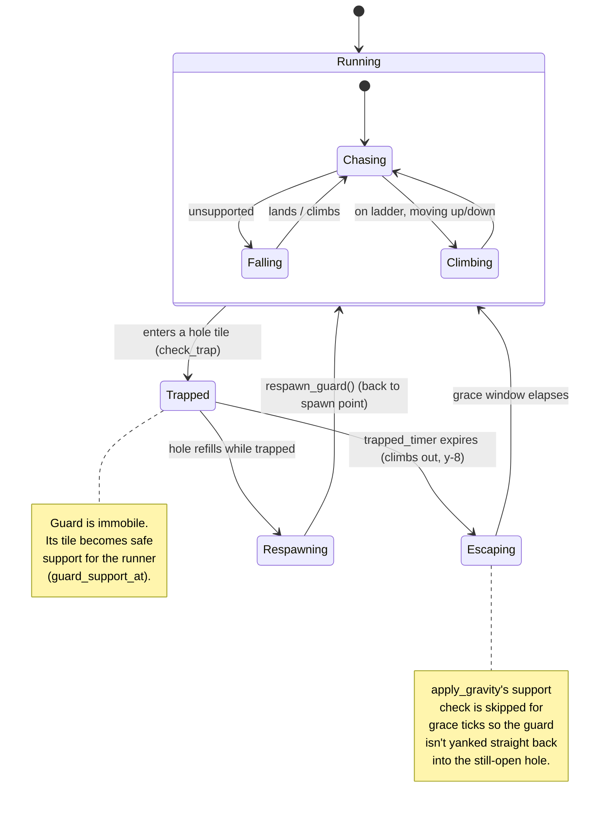

## 4. Guard AI in Detail

The guard AI is a feature enhanced version of classic runner or chasing games. It replaced an earlier
greedy "move towards the runner on both axes" controller, which could not express a detour
and therefore stalled whenever reaching the runner required temporarily increasing distance.

Two properties define it:

- **It is not a pathfinder.** There is no BFS, no A\*, no open/closed set, no memory between
  frames. Every decision is recomputed from scratch against the live tile grid.
- **It is deliberately exploitable.** The scan is limited to the guard's *current floor
  segment*, so a player can bait guards into predictable positions. This is a gameplay
  requirement, not a limitation to be fixed — a true shortest-path chase would be unbeatable
  and unfun.

### 4.1 The Three-Layer Decision

`guard_ai(g)` returns exactly **one** action per call: `"left"`, `"right"`, `"up"`, `"down"`,
or `nil` (stand still). Layers are evaluated in priority order and the first one that
produces an answer wins.

| Layer | Condition | Mechanism | Result |
|-------|-----------|-----------|--------|
| 1 — Gravity | guard unsupported | handled entirely by `apply_gravity`, not by the AI | AI output ignored while falling |
| 2 — Same-floor dash | `gy == ry` and runner not falling | virtual cursor walk from `gx` to `rx` verifying every tile is standable | `"left"` / `"right"` if the cursor arrives |
| 3 — Floor scan | everything else | `scan_floor` rates every descent/climb point on the current floor segment | direction of the best-rated probe |

Returning a single action rather than a set of directional booleans is essential: the shared
physics apply horizontal and vertical movement in the same tick, and `try_vertical_move`
snaps `e.x` onto the ladder column. A simultaneous "left" + "down" would see the horizontal
step silently discarded every frame, pinning the guard to the ladder column.

### 4.2 Pit-Awareness Policy

`guards_pit_aware` controls only route planning; it does not disable pit physics or trap
detection. The default is `true`.

```lua
guards_pit_aware=true   -- guards route around live dug pits
guards_pit_aware=false  -- guards ignore live dug pits while choosing a route
```

`is_guard_pit(tx, ty)` is the central policy predicate. A tile is a recognized guard pit only
when it exists in the live `holes` table *and* `guards_pit_aware` is true. The AI uses this
predicate through `can_walk_at`, `can_branch`, and `scan_down`:

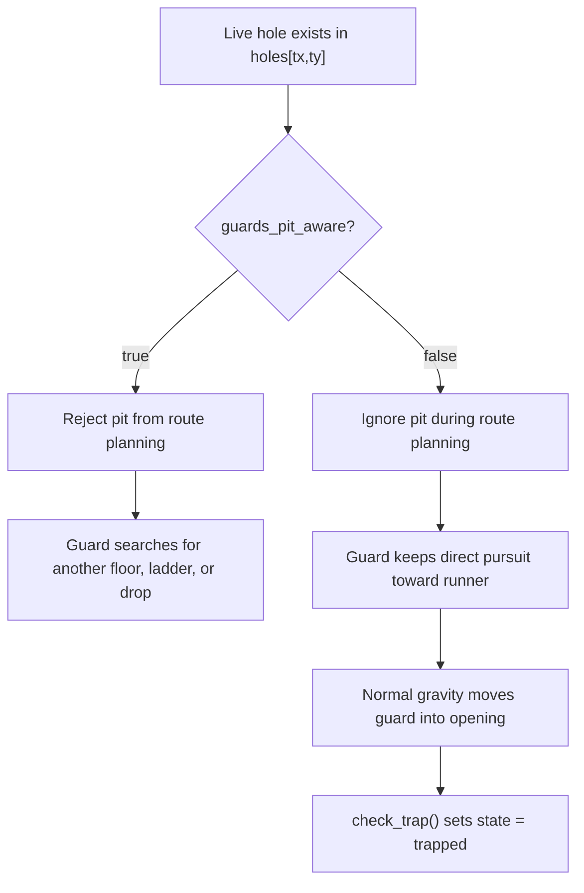

The coordinate relationship is important. A guard walking on `(tx, ty)` falls into a dug
brick at `(tx, ty+1)`. Therefore, in unaware mode `can_walk_at(tx, ty)` also treats the tile
above a live hole as traversable. Without this case, the same-floor path check would reject
the position before physics could make the guard fall, and the AI could turn away even though
pit awareness was disabled.

The policy deliberately leaves `try_dig`, `apply_gravity`, and `check_trap` unchanged:

| Setting | Route planner | Physics and trap result |
|---------|---------------|-------------------------|
| `true` | Rejects live pits and searches for another route | A guard that nevertheless reaches a pit can still fall and be trapped |
| `false` | Treats live pits, including their walk tiles, as ordinary route space | A guard pursuing across a newly dug pit can fall and become trapped |

This is a gameplay policy rather than a collision mode. Turning awareness off makes guards
less cautious; it does not make pits non-existent.

### 4.3 Use Case Diagram

Actors and the goals the guard AI subsystem serves.

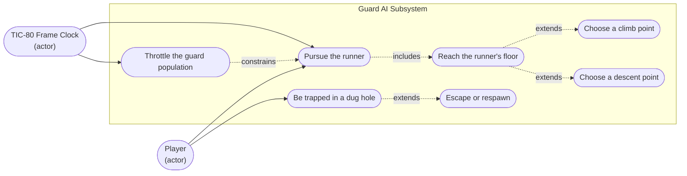

### 4.4 Package Diagram

Dependency direction is strictly downward — the AI reads the tile grid but never writes it.

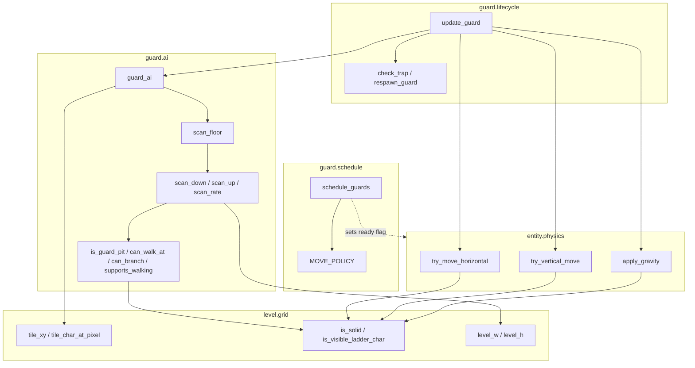

### 4.5 Component Diagram

Provided and required interfaces between the guard components.

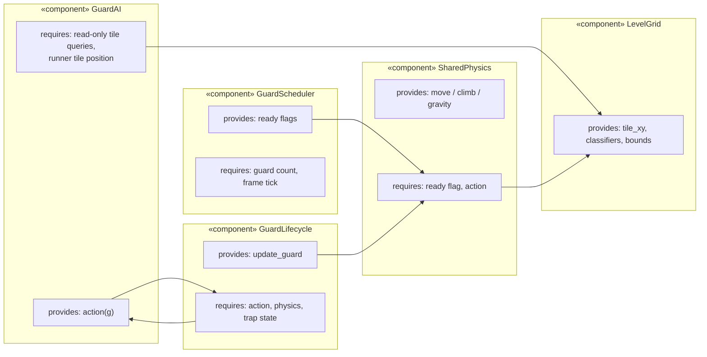

### 4.6 Composite Structure Diagram

Internal wiring of the `GuardAI` component, showing ports and the delegation of each
port to an internal part.

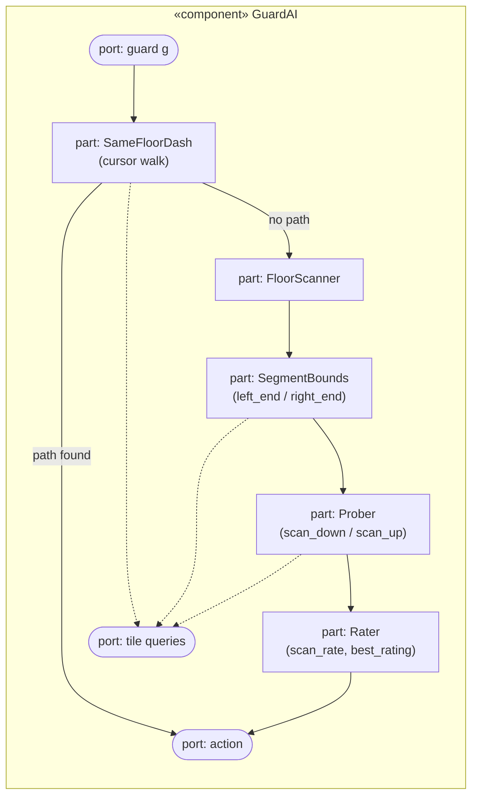

### 4.7 Class Diagram

The AI is plain functions over tables; modelled here as classes for clarity. Note the
`ready` attribute added to `Entity` — it is the contract between scheduler and physics.

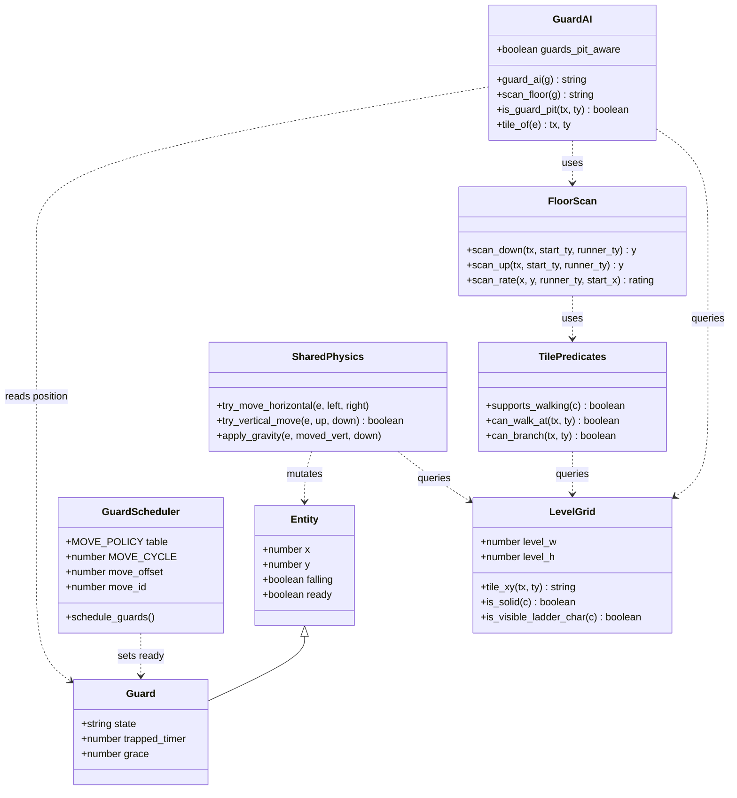

### 4.8 Object Diagram

A snapshot of level 3 at the instant the third guard decides to go left (see the worked
example in 4.17). Values are tile coordinates unless suffixed with `px`.

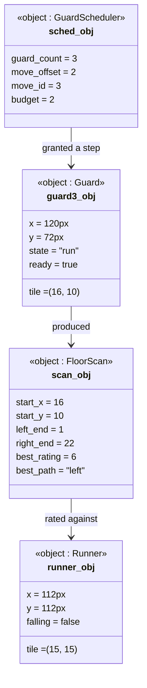

### 4.9 Activity Diagram — `guard_ai`

Swimlanes separate the two decision layers from the grid queries they depend on.

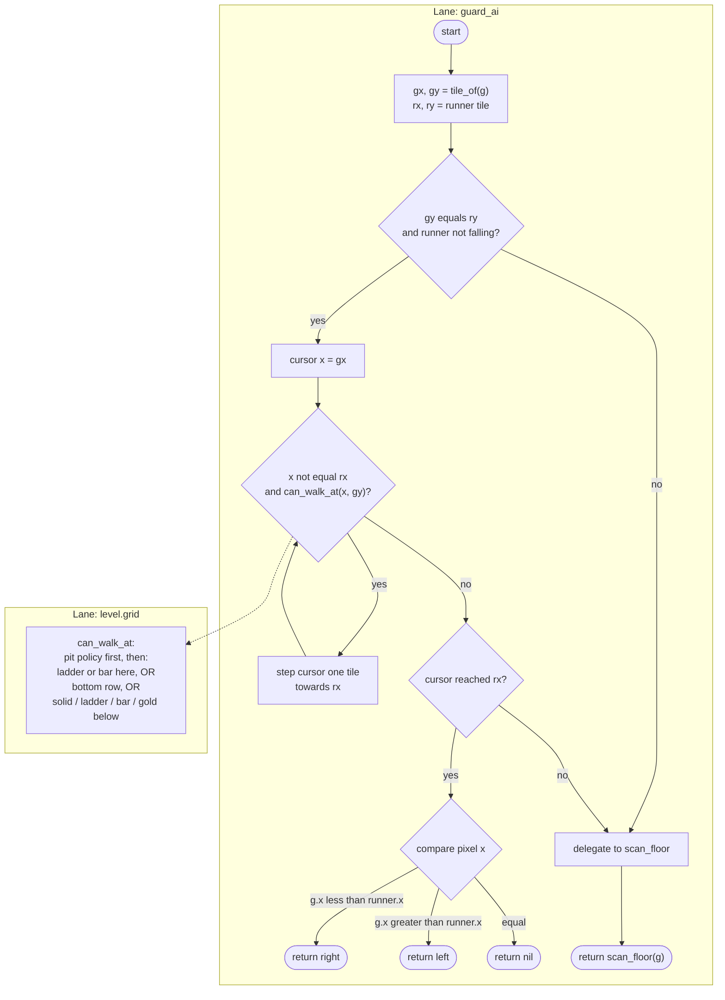

### 4.10 Activity Diagram — `scan_floor`

This is the core routine and the reason guards now seek ladders.

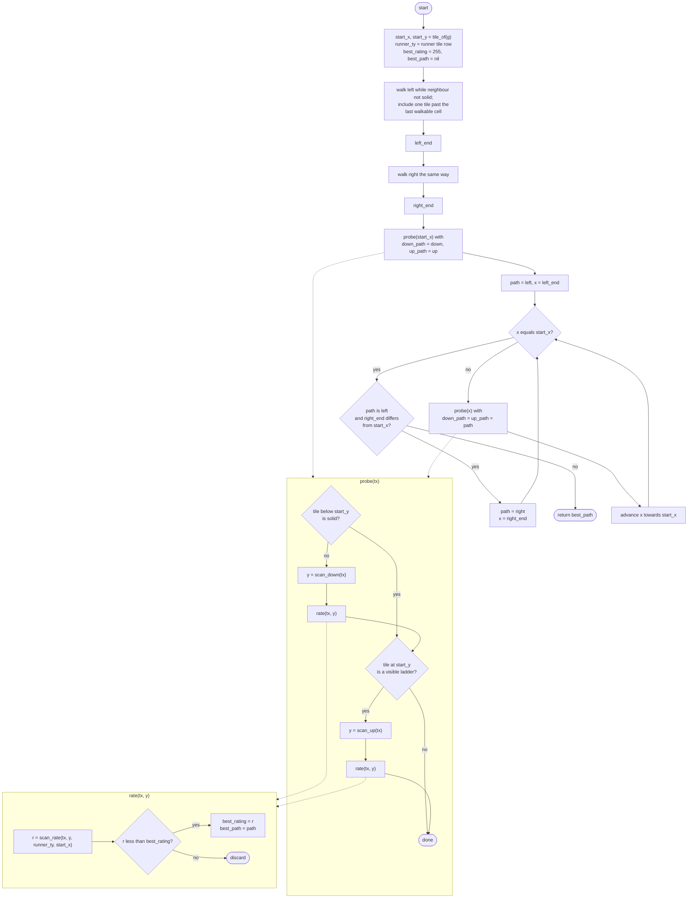

Note the deliberate asymmetry in the segment-bounds walk: the loop steps onto the boundary
tile **and then** breaks if that tile was not walkable. The drop at the end of a platform is
therefore itself a candidate probe column — that is how a guard decides to walk off a ledge.

### 4.11 State Machine Diagram — AI Action State

Complements the lifecycle machine in section 3. This one models what the *decision* layer
produces, which is orthogonal to trap/respawn state.

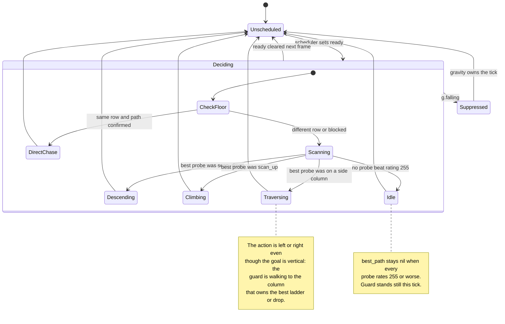

### 4.12 Sequence Diagram — One Scheduled Guard Tick

```mermaid
sequenceDiagram
    participant Loop as TIC()
    participant Sched as schedule_guards
    participant UG as update_guard
    participant AI as guard_ai
    participant SF as scan_floor
    participant Scan as scan_down / scan_up
    participant Grid as level grid
    participant Phys as shared physics

    Loop->>Sched: schedule_guards()
    Sched->>Sched: clear ready on every guard
    alt t mod STEP_TICKS is 0
        Sched->>Sched: advance move_offset (1..6)
        Sched->>Sched: budget = MOVE_POLICY[n][move_offset]
        loop budget times
            Sched->>Sched: move_id = next guard (round robin)
            Sched->>UG: mark ready unless trapped
        end
    end

    loop each guard
        Loop->>UG: update_guard(g)
        alt g.state is trapped
            UG->>UG: tick trapped_timer, maybe climb out
        else
            UG->>AI: guard_ai(g)
            AI->>Grid: tile_of(g), runner tile
            alt same floor
                AI->>Grid: can_walk_at along cursor path
                Grid-->>AI: standable / blocked
                AI-->>UG: "left" or "right"
            else
                AI->>SF: scan_floor(g)
                SF->>Grid: find left_end / right_end
                loop each column in segment
                    SF->>Scan: scan_down / scan_up
                    Scan->>Grid: tile_xy, can_branch
                    Grid-->>Scan: tile chars
                    Scan-->>SF: landing row y
                    SF->>SF: scan_rate, keep best
                end
                SF-->>AI: best_path
                AI-->>UG: action
            end
            UG->>Phys: try_move_horizontal(g, action is left, action is right)
            UG->>Phys: try_vertical_move(g, action is up, action is down)
            Phys-->>UG: moved_vert
            UG->>Phys: apply_gravity(g, moved_vert, action is down)
            Note over Phys: every entry point returns early unless g.ready
            UG->>UG: check_trap(g)
        end
    end
```

### 4.13 Communication Diagram

The same interaction, emphasising the object links and message ordering rather than the
timeline.

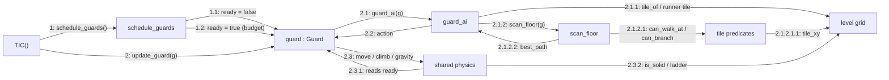

### 4.14 Interaction Overview Diagram

Control flow between the interaction fragments defined above.

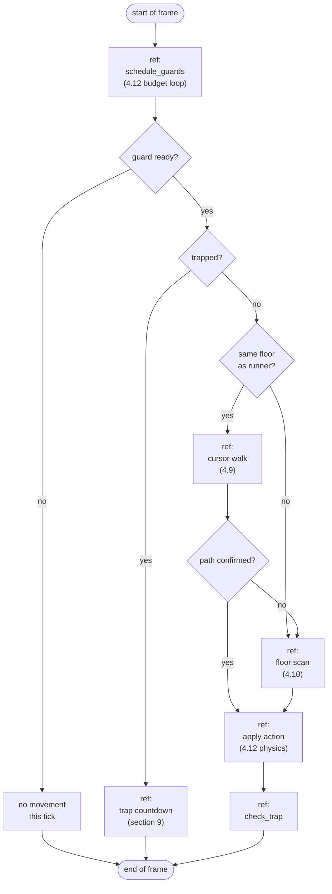

### 4.15 Timing Diagram — `MOVE_POLICY` Cadence

UML timing diagram showing scheduler state over one full policy cycle with three guards
on level 3. The policy row for three guards is `{1,2,1,1,2,1}` — eight steps per cycle.
The scheduler only runs on frames where `t mod STEP_TICKS == 0`, so one cycle spans
6 × 3 = 18 TIC frames.

```text
 TIC frame   : 0    3    6    9    12   15   18
 move_offset : 1    2    3    4    5    6    1
 budget      : 1    2    1    1    2    1    1
              ---------------------------------
 guard[1]    : __/‾‾\____________/‾‾\_______/‾‾\
 guard[2]    : ______/‾‾\____________/‾‾\______
 guard[3]    : ___________/‾‾\____/‾‾\_________
              ---------------------------------
 runner      : /‾\__/‾\__/‾\__/‾\__/‾\__/‾\__/‾\
              (steps every STEP_TICKS = 3 frames)

 ‾‾ = ready (movement permitted this frame)
 __ = not scheduled
```

Resulting rates, compared with the fixed 6-frame gate this replaced:

| Guards | Steps per cycle | Per guard | Equivalent period | vs. old fixed gate |
|--------|-----------------|-----------|-------------------|--------------------|
| 1 | 4 | 4.00 | 1 step / 4.5 frames | faster |
| 2 | 6 | 3.00 | 1 step / 6.0 frames | identical |
| 3 | 8 | 2.67 | 1 step / 6.75 frames | slightly slower |

The sublinear growth is the point: a lone guard is genuinely threatening, while a crowd is
individually sluggish, so difficulty does not scale linearly with guard count.

### 4.16 Deployment Diagram

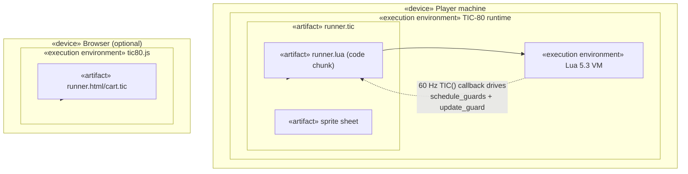

The guard AI has no distribution concerns — it is included here for completeness. The only
deployment-relevant property is that the entire AI must fit the single-chunk cart constraint
(NFR-8.1/NFR-8.5), which rules out external pathfinding libraries.

### 4.17 Profile Diagram

Stereotypes used across the diagrams in this section.

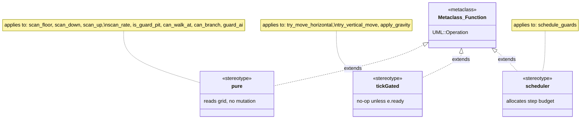

The `pure` stereotype is a real invariant worth preserving: **no AI function mutates the
level or any entity**. All mutation happens in the physics layer. This is what makes the AI
safe to call repeatedly, and what would make it testable in isolation.

### 4.18 The Rating Function

`scan_rate` is the heart of the algorithm. It converts a probe's landing row into a cost,
using banded constants that encode a lexicographic preference rather than a distance metric.

```lua
if y == runner_ty then return math.abs(start_x - x) end   -- band 0
if y  > runner_ty then return y - runner_ty + 200 end      -- band 200
return runner_ty - y + 100                                 -- band 100
```

| Band | Meaning | Range | Interpretation |
|------|---------|-------|----------------|
| `0 + abs(start_x - x)` | probe lands on the runner's row | 0 … ~level width | best; ties broken by nearest column |
| `100 + (runner_ty - y)` | probe ends **above** the runner | 101 … ~100+height | acceptable; guards prefer height |
| `200 + (y - runner_ty)` | probe ends **below** the runner | 201 … ~200+height | worst; hard to recover from |

Because the bands are wider than any achievable in-band value on these level sizes, the
comparison is effectively: *reach the runner's row first; failing that, end up above them;
only then minimise distance*. `best_rating` starts at 255, so a probe landing more than 55
rows below the runner would be rejected outright — unreachable on a 16-row level, which is
why 255 works as a sentinel.

Ties resolve to whichever probe ran first, because the comparison is `<` and not `<=`. Probe
order is: centre column, then left end sweeping right, then right end sweeping left.

### 4.19 Worked Example — Level 3, Third Guard

Initial state: guard 3 spawns at pixel `(120, 72)` → tile `(16, 10)`. The runner spawns at
pixel `(112, 112)` → tile `(15, 15)`. Different rows, so layer 2 is skipped and `scan_floor`
runs.

**Segment bounds on row 10.** Row 11 beneath it is `#########H##########H` — solid almost
everywhere, so the guard can walk freely. The left walk runs to `left_end = 1`; the right
walk stops at `right_end = 22`, one tile past column 21, because column 22 has nothing
underneath it.

**Probes and ratings:**

| Column | Probe | Landing row | Rating | Note |
|--------|-------|-------------|--------|------|
| 16 (centre) | — | — | — | row 11 below is solid, no ladder here: no probe |
| 3 | `scan_up` | 7 | `100 + (15-7) = 108` | ladder up to row 7, wrong direction |
| **10** | **`scan_down`** | **15** | **`abs(16-10) = 6`** | **ladder down to row 13, then falls to row 15** |
| 21 | `scan_down` | 13 | `100 + (15-13) = 102` | ladder ends on row 13, above the runner |
| 21 | `scan_up` | 7 | `108` | wrong direction |
| 22 | `scan_down` | 13 | `102` | open drop, lands above the runner |

Column 10 is the only probe that reaches the runner's row, so it wins with rating 6 and
`best_path = "left"` (column 10 lies left of the guard's column 16).

**Behaviour:** the guard walks *left*, away from nothing in particular but towards the ladder
at column 10 — the ladder descends rows 11–13, after which the guard falls to row 15 and lands
on the runner's floor. The old greedy AI would have set `down` (runner is below) and `left`
(runner is left), then been pinned to whatever ladder column it first touched.

### 4.20 Known Characteristics

These are consequences of the design, documented so they are not mistaken for defects:

- **Single-segment horizon.** A guard only considers ladders and drops reachable on its
  current floor segment. Multi-hop routes emerge frame by frame as the guard arrives on each
  new floor, not from any plan.
- **No tie-breaking jitter guard.** Two equally-rated probes on opposite sides resolve by
  probe order, which is stable — but a guard oscillating between floors can flip its answer as
  `start_x` changes. Worth watching in play-testing.
- **Runner-falling exception.** Layer 2 is skipped while `runner.falling`, matching the
  reference implementation; without it a guard on a ladder would commit to a horizontal dash
  at a runner who is about to leave the row.
- **Hidden ladders are invisible to the AI.** All predicates go through
  `is_visible_ladder_char`, so an unrevealed `h` tile is treated as empty space. Revealing the
  escape ladders therefore changes guard routing, not just the runner's options.
- **Pit awareness is policy-controlled.** `is_guard_pit` combines the live `holes` registry
    with `guards_pit_aware`. When awareness is enabled, `can_walk_at`, `can_branch`, and
    `scan_down` exclude live pits from route planning. When it is disabled, `can_walk_at` also
    treats the walk tile directly above a live pit as traversable, so direct pursuit continues
    and physics can drop the guard into the pit.
- **Dug holes are read from live state.** `try_dig` writes a blank into `level` and records the
    hole in `holes`; the AI uses both representations. `check_trap` remains authoritative for
    the outcome, so disabling awareness makes a guard more likely to be trapped rather than
    making the pit harmless.

## 5. Frame Sequence (One `TIC()` Tick)

```mermaid
sequenceDiagram
    participant TIC80 as TIC-80 Engine
    participant Loop as TIC()
    participant Runner
    participant Holes
    participant Guards
    participant Collision
    participant Render

    TIC80->>Loop: call TIC() (~60x/sec)
    alt level_complete and not final_level_complete
        Loop->>Loop: increment level_complete_timer
        alt timer reaches 360 ticks and another level exists
            Loop->>Loop: load_level(current_level + 1)
        else timer reaches 360 ticks on final level
            Loop->>Loop: final_level_complete = true
        end
    else not game_over and not level_complete
        Loop->>Runner: try_move_horizontal / try_vertical_move / apply_gravity
        Loop->>Runner: box pickup check
        Loop->>Runner: try_dig() on btnp(4)/btnp(5)
        Loop->>Holes: update_holes() (tick down, refill, respawn trapped guard)
        Loop->>Guards: schedule_guards() (clear ready flags, grant shared step budget)
        loop each guard
            Loop->>Guards: update_guard() (AI -> ready-gated physics -> check_trap)
        end
        Loop->>Collision: check_guard_collision() -> lose_life() if caught
        Loop->>Collision: check_offscreen_falls() -> runner loses life or guard respawns
        Loop->>Loop: evaluate level_complete
    end
    Loop->>Render: draw level tiles
    Loop->>Render: draw guards (state-based sprite)
    Loop->>Render: draw runner (animation state)
    Loop->>Render: draw HUD (boxes/lives or game-over/level-complete)
    Loop->>Render: draw level progress and transition countdown
    Render-->>TIC80: frame buffer
```

## 6. Level Completion & Progression

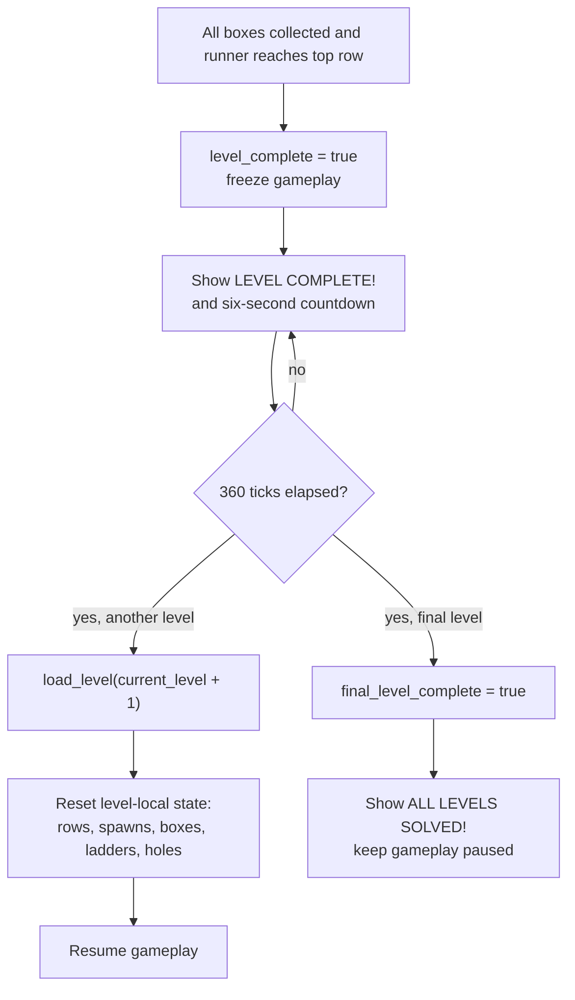

## 7. Off-Screen Fall Recovery

```mermaid
flowchart LR
    A["Entity physics updates"] --> B{"Entity y > 136?"}
    B -- no --> C["Continue normal gameplay"]
    B -- yes, runner --> D["lose_life()\nrunner respawns\nall guards reset"]
    B -- yes, guard --> E["respawn_guard(g)\nguard returns to own spawn"]
```

## 8. Digging Flow

```mermaid
flowchart TD
    A["Player presses dig key\n(Z/Y key or gamepad btn 4 = left,\nbtn 5 = right)"] --> B{"Target tile\n(one row below player,\nadjacent column) is brick '#'?"}
    B -- no --> Z1["No-op"]
    B -- yes --> C{"Tile directly above\nthe target is solid\n('#' or '=')?"}
    C -- "yes, and it is NOT\nan already-open pit" --> Z2["Blocked: would dig\na pit nothing can\never fall into"]
    C -- "no (open air, ladder, bar,\nor already an open pit)" --> D{"A hole already\ntracked at that tile?"}
    D -- yes --> Z3["No-op (one hole per tile)"]
    D -- no --> E["Tile cleared to ' '\nhole recorded: {tx,ty,timer=HOLE_LIFETIME,orig='#'}"]
```

## 9. Hole Lifecycle: Guard Trap vs. Runner Buried (Timing)

Tick numbers use the current tuning constants (`GUARD_TRAP_ESCAPE=150`,
`HOLE_LIFETIME=360`, `GUARD_STEP_TICKS=6` → escape grace `= GUARD_STEP_TICKS*4 = 24`).
Both branches start at the moment the hole is dug (tick 0).

```mermaid
sequenceDiagram
    participant Hole
    participant Guard
    participant Runner

    Note over Hole: tick 0 - hole dug, timer=360

    alt Guard falls into the hole (check_trap)
        Hole->>Guard: traps it, trapped_timer=150
        Note over Guard: tick 0..150 - immobile,\nsupports the runner if stepped on
        alt Escape before refill (150 < remaining hole life)
            Guard->>Guard: tick 150 - trapped_timer expires\ny -= 8, state=running, grace=24
            Note over Guard: tick 150..174 - grace window,\ngravity support-check skipped
            Guard->>Guard: tick 174 - grace ends, resumes\nnormal chase (already walked clear)
        else Hole refills first (guard fell in late)
            Hole->>Hole: tick 360 - timer expires\nwhile hole.guard is still set
            Hole->>Guard: respawn_guard() - back to\nspawn_x/spawn_y, state=running
        end
    else Runner is standing in the hole's tile when it refills
        Runner->>Hole: still overlapping (tx,ty) at tick 360
        Hole->>Runner: lose_life() - close_all_holes() first
        Hole->>Hole: restore every active pit to orig ('#')\nand clear holes registry
        Hole->>Runner: runner respawns, ALL guards reset\nto their configured spawns
        Note over Hole: update_holes() returns immediately\nso no stale pit entry is processed
        Note over Runner,Guard: matches original arcade behavior:\ndeath resets every actor's position
    end
    Hole->>Hole: tile restored to orig ('#')
```

## 10. Module Responsibilities (Reference Table)

| Section in `runner.lua`            | Responsibility                                                        | Related Requirements |
|-------------------------------------|-------------------------------------------------------------------------|-----------------------|
| Level data/loading (`level_data`, `load_level`) | Multi-level records, active-level binding, level-local reset | FR-2.12, FR-2.13, FR-9.1, FR-9.2 |
| Level helpers (`tile_xy`, `set_tile_xy`, `tile_char_at_pixel`, `count_boxes`) | Grid storage & mutation, pixel-to-tile resolution | FR-1.x |
| `get_context`, `is_solid`, `is_visible_ladder_char` | Tile classification shared by all physics code | FR-1.x, NFR-1.1 |
| `try_move_horizontal`, `try_vertical_move`, `apply_gravity` (incl. `e.grace` immunity window) | Shared movement/gravity/climbing primitives for any entity | FR-2.x, FR-4.4a, NFR-2.2 |
| `try_dig` (incl. above-tile solid check), `update_holes`, `close_all_holes` | Hole creation, above-tile validation, lifetime management, buried-runner death, and pit cleanup before respawn | FR-3.x, FR-5.2a |
| `guard_ai`, `scan_floor`, `scan_down`, `scan_up`, `scan_rate`, `is_guard_pit`, `can_walk_at`, `can_branch` | Classic runner or chasing game pursuit: same-floor dash, floor-segment scan, banded rating, and configurable live-pit awareness (see section 4) | FR-4.x |
| `schedule_guards`, `MOVE_POLICY` | Shared guard step budget; sublinear difficulty scaling with guard count | FR-4.x, NFR-2.2 |
| `update_guard`, `check_trap`, `respawn_guard`, `guard_support_at` | Guard lifecycle: action dispatch, trapping, escape (with grace)/respawn, safe-support behavior | FR-4.x |
| `overlaps`, `check_guard_collision`, `check_offscreen_falls`, `lose_life` (resets runner AND all guards) | Player/guard collision resolution, off-screen recovery, lives & game-over | FR-5.x |
| `TIC()` completion branch | Six-second level transition and final-level celebration | FR-2.12, FR-2.13, FR-6.6 |
| `TIC()` draw section (per-state guard/runner sprite selection) | Tile/entity/HUD rendering, level progress, boxes, lives, countdown | FR-6.x, FR-4.8 |
| `TIC()` input reads (`btn`, `btnp`, `keyp`) | Player input polling, dual-layout dig key | FR-7.x |

## 11. Design Rationale & Trade-offs

- **Single-file, sectioned layout** rather than multiple Lua modules: TIC-80 carts are most
  portable as one file; sections are kept cohesive by naming convention and ordering
  (level → physics → digging → guards → collision → loop) instead of a module system.
- **Tables over classes**: Lua's lightweight tables are sufficient for the current entity
  count (1 runner + up to 3 guards); introducing metatables/OOP would add indirection without
  benefit at this scale (kept in mind for FR-9.x if entity variety grows).
- **Tick-gated movement via a `ready` flag**: the runner sets `ready` from `STEP_TICKS`, while
  guards receive it from `schedule_guards`. Routing both through the same flag keeps the shared
  physics ignorant of *why* an entity may move this frame, so the scheduler could be changed or
  removed without touching movement code.
- **Ported guard AI rather than a pathfinder**: `scan_floor` reproduces the original's
  floor-segment scan and its `0 / +100 / +200` rating bands verbatim. A BFS or A\* chase would be
  strictly "better" at catching the runner and strictly worse as a game — the exploitable,
    single-segment horizon is the mechanic (see section 4.20). Pit awareness is layered on top
    of that scan so the same AI can intentionally choose between cautious and trap-prone play.
- **Flush-snapping on tile transitions**: climbing/landing snaps position to the tile grid
  to avoid sub-pixel overlap bugs (see project history: ladder/bar alignment fixes) — this is
  now centralized in `try_vertical_move`/`apply_gravity` instead of duplicated per entity.
- **Grace-period after escaping a hole**: standing on the tile above a still-open hole is, by
  the same physics that trapped the guard in the first place, unsupported - naively climbing
  out would cause an immediate fall back in and permanent re-trapping. `e.grace` suppresses
  the support check for a few ticks (long enough to fully clear the hole's column) instead of
  special-casing hole tiles as "supported", which would otherwise break the original trap
  mechanic entirely.
- **Full actor reset on death**: `lose_life()` resets every guard to its spawn point, not just
  the runner, matching the original arcade behavior and avoiding the runner respawning right
  next to (or on top of) the guard that just caught it.
- **Pit cleanup precedes actor reset**: `close_all_holes()` restores every active pit and clears
    the hole registry before runner and guard positions are reset. The buried-runner branch then
    returns from `update_holes()` immediately, preventing the old hole table from being processed
    after life-loss state has already been reset.
- **Above-tile dig check uses the live grid, not the static level data**: checking
  `tile_xy` (which digging/refill already mutate in place) means an already-open pit above the
  target naturally reads as non-solid, with no separate bookkeeping needed for that exception.
