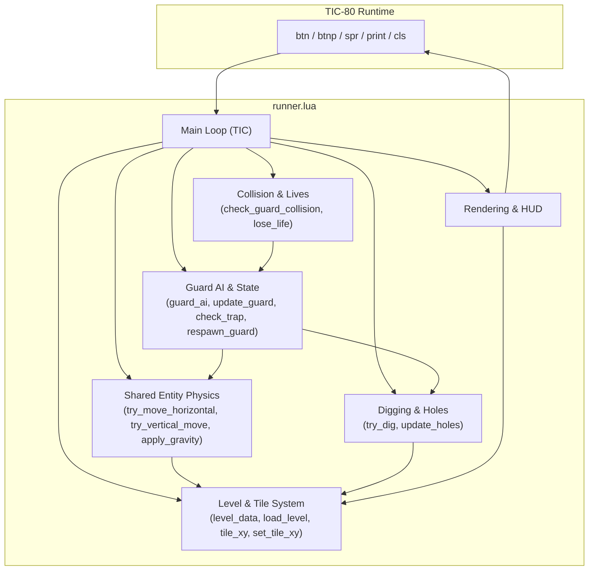
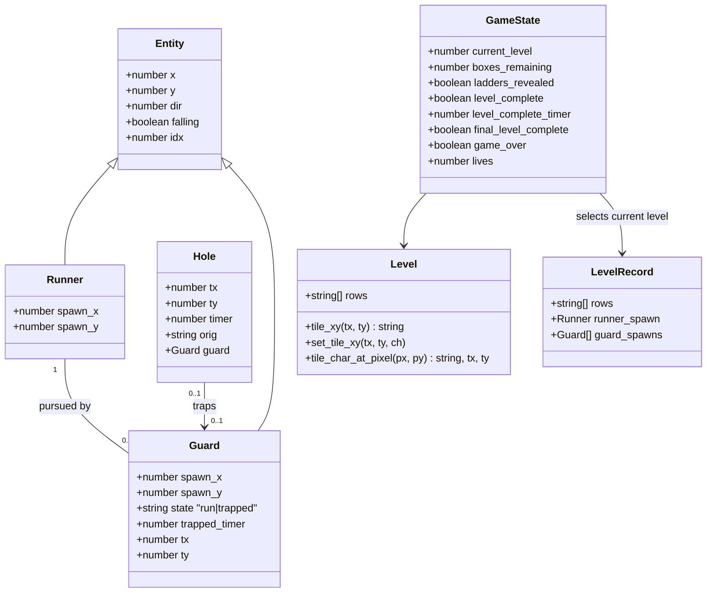
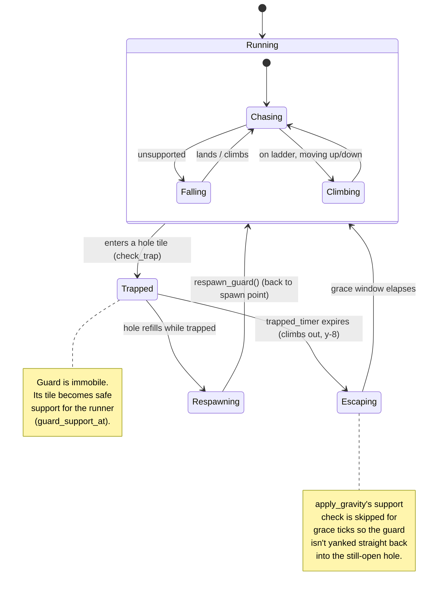
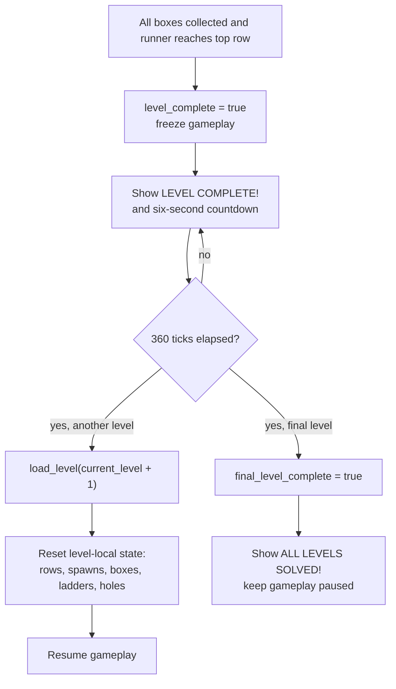
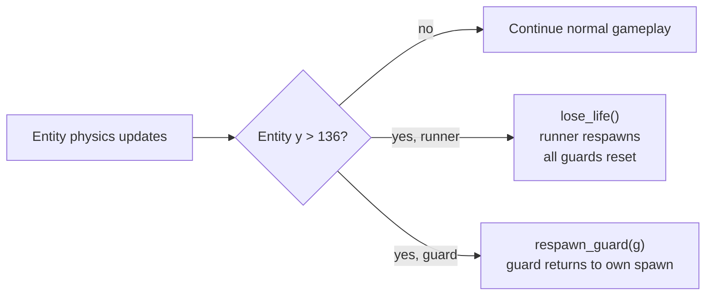
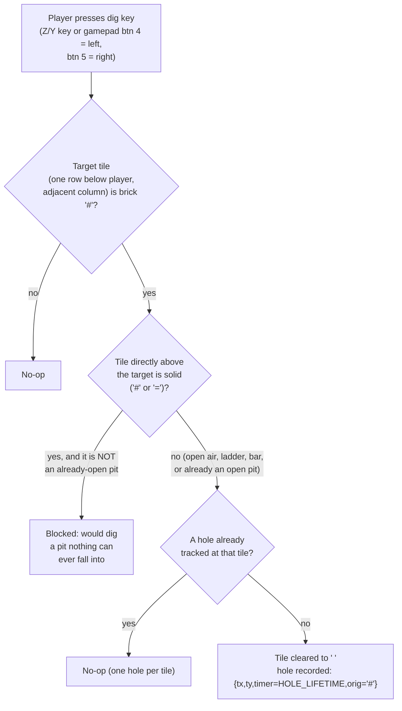
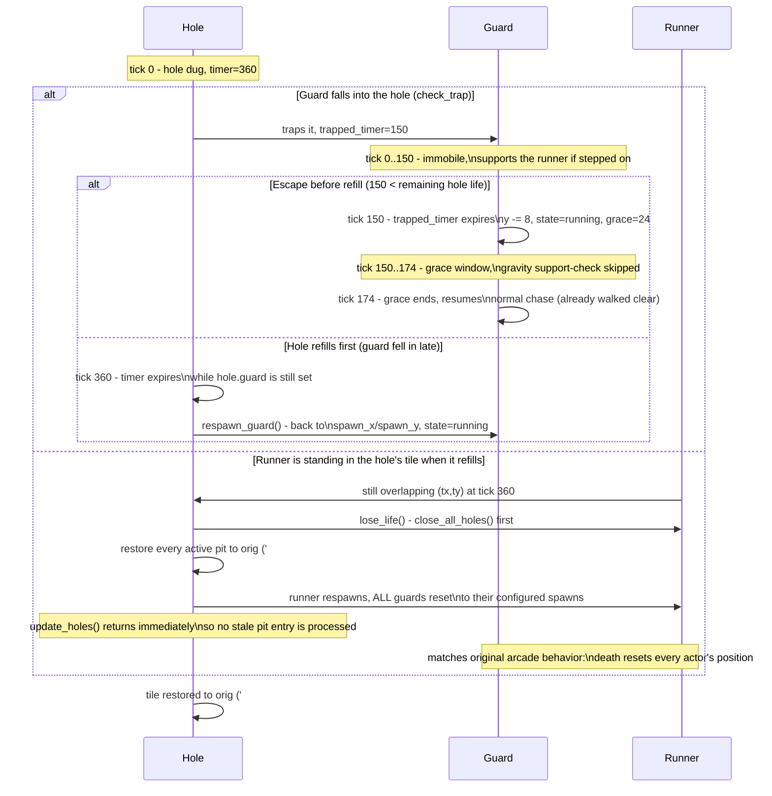

# Software Architecture — TIC-80 Lode Runner Clone

Companion document to [requirements.md](requirements.md). Describes the structure of
`runner.lua` as implemented: a single TIC-80 cart driven by the `TIC()` callback, with
gameplay split into a level/tile layer, shared entity physics, and per-feature systems
(digging, guards, collision) orchestrated once per frame.

## 1. Architectural Overview

The cart has no external modules (TIC-80 constraint, see NFR-8.1/NFR-8.5). Internally it is
organized into layers by responsibility, all within one file:



Key design decision: **runner and guards share the same physics functions** (`try_move_horizontal`,
`try_vertical_move`, `apply_gravity`), parameterized by a generic *entity* table and boolean
directional inputs. The runner supplies real button state; guards supply AI-derived intent
(`guard_ai`). This satisfies NFR-2.2 and NFR-4.1/4.2 and avoids duplicated movement code.

## 2. Data Model (Class / Entity Diagram)

Entities are plain Lua tables, not OOP classes (no metatables needed at this scope). The
diagram below models them as classes for clarity.



Each entry in `level_data` is a `LevelRecord` containing the tile rows, one runner spawn
table, and a configurable guard spawn list. `load_level(level_index)` binds those records
to the active `level`, `runner`, and `guards` tables and resets level-local mutable state.

## 3. Guard State Machine

Guards are the only entities with an explicit state machine (`run` / `trapped`); the runner
is stateless aside from its `falling` flag, since it never gets trapped by design (falling
into a hole behaves like normal empty-space physics for the player).



## 4. Frame Sequence (One `TIC()` Tick)

```mermaid
sequenceDiagram
    participant TIC80 as TIC-80 Engine
    participant Loop as TIC()
    participant Runner
    participant Holes
    participant Guards
    participant Collision
    participant Render

    TIC80->>Loop: call TIC() (~60x/sec)
    alt level_complete and not final_level_complete
        Loop->>Loop: increment level_complete_timer
        alt timer reaches 360 ticks and another level exists
            Loop->>Loop: load_level(current_level + 1)
        else timer reaches 360 ticks on final level
            Loop->>Loop: final_level_complete = true
        end
    else not game_over and not level_complete
        Loop->>Runner: try_move_horizontal / try_vertical_move / apply_gravity
        Loop->>Runner: box pickup check
        Loop->>Runner: try_dig() on btnp(4)/btnp(5)
        Loop->>Holes: update_holes() (tick down, refill, respawn trapped guard)
        loop each guard
            Loop->>Guards: update_guard() (AI -> physics -> check_trap)
        end
        Loop->>Collision: check_guard_collision() -> lose_life() if caught
        Loop->>Collision: check_offscreen_falls() -> runner loses life or guard respawns
        Loop->>Loop: evaluate level_complete
    end
    Loop->>Render: draw level tiles
    Loop->>Render: draw guards (state-based sprite)
    Loop->>Render: draw runner (animation state)
    Loop->>Render: draw HUD (boxes/lives or game-over/level-complete)
    Loop->>Render: draw level progress and transition countdown
    Render-->>TIC80: frame buffer
```

## 5. Level Completion & Progression



## 6. Off-Screen Fall Recovery



## 7. Digging Flow



## 8. Hole Lifecycle: Guard Trap vs. Runner Buried (Timing)

Tick numbers use the current tuning constants (`GUARD_TRAP_ESCAPE=150`,
`HOLE_LIFETIME=360`, `GUARD_STEP_TICKS=6` → escape grace `= GUARD_STEP_TICKS*4 = 24`).
Both branches start at the moment the hole is dug (tick 0).



## 9. Module Responsibilities (Reference Table)

| Section in `runner.lua`            | Responsibility                                                        | Related Requirements |
|-------------------------------------|-------------------------------------------------------------------------|-----------------------|
| Level data/loading (`level_data`, `load_level`) | Multi-level records, active-level binding, level-local reset | FR-2.12, FR-2.13, FR-9.1, FR-9.2 |
| Level helpers (`tile_xy`, `set_tile_xy`, `tile_char_at_pixel`, `count_boxes`) | Grid storage & mutation, pixel-to-tile resolution | FR-1.x |
| `get_context`, `is_solid`, `is_visible_ladder_char` | Tile classification shared by all physics code | FR-1.x, NFR-1.1 |
| `try_move_horizontal`, `try_vertical_move`, `apply_gravity` (incl. `e.grace` immunity window) | Shared movement/gravity/climbing primitives for any entity | FR-2.x, FR-4.4a, NFR-2.2 |
| `try_dig` (incl. above-tile solid check), `update_holes`, `close_all_holes` | Hole creation, above-tile validation, lifetime management, buried-runner death, and pit cleanup before respawn | FR-3.x, FR-5.2a |
| `guard_ai`, `update_guard`, `check_trap`, `respawn_guard`, `guard_support_at` | Guard pursuit, trapping, escape (with grace)/respawn, safe-support behavior | FR-4.x |
| `overlaps`, `check_guard_collision`, `check_offscreen_falls`, `lose_life` (resets runner AND all guards) | Player/guard collision resolution, off-screen recovery, lives & game-over | FR-5.x |
| `TIC()` completion branch | Six-second level transition and final-level celebration | FR-2.12, FR-2.13, FR-6.6 |
| `TIC()` draw section (per-state guard/runner sprite selection) | Tile/entity/HUD rendering, level progress, boxes, lives, countdown | FR-6.x, FR-4.8 |
| `TIC()` input reads (`btn`, `btnp`, `keyp`) | Player input polling, dual-layout dig key | FR-7.x |

## 10. Design Rationale & Trade-offs

- **Single-file, sectioned layout** rather than multiple Lua modules: TIC-80 carts are most
  portable as one file; sections are kept cohesive by naming convention and ordering
  (level → physics → digging → guards → collision → loop) instead of a module system.
- **Tables over classes**: Lua's lightweight tables are sufficient for the current entity
  count (1 runner + 2 guards); introducing metatables/OOP would add indirection without
  benefit at this scale (kept in mind for FR-9.x if entity variety grows).
- **Tick-gated movement (`STEP_TICKS`)**: keeps speed deterministic and independent of any
  future frame-rate changes, and keeps guard/runner speed directly comparable.
- **Flush-snapping on tile transitions**: climbing/landing snaps position to the tile grid
  to avoid sub-pixel overlap bugs (see project history: ladder/bar alignment fixes) — this is
  now centralized in `try_vertical_move`/`apply_gravity` instead of duplicated per entity.
- **Grace-period after escaping a hole**: standing on the tile above a still-open hole is, by
  the same physics that trapped the guard in the first place, unsupported - naively climbing
  out would cause an immediate fall back in and permanent re-trapping. `e.grace` suppresses
  the support check for a few ticks (long enough to fully clear the hole's column) instead of
  special-casing hole tiles as "supported", which would otherwise break the original trap
  mechanic entirely.
- **Full actor reset on death**: `lose_life()` resets every guard to its spawn point, not just
  the runner, matching the original arcade behavior and avoiding the runner respawning right
  next to (or on top of) the guard that just caught it.
- **Pit cleanup precedes actor reset**: `close_all_holes()` restores every active pit and clears
    the hole registry before runner and guard positions are reset. The buried-runner branch then
    returns from `update_holes()` immediately, preventing the old hole table from being processed
    after life-loss state has already been reset.
- **Above-tile dig check uses the live grid, not the static level data**: checking
  `tile_xy` (which digging/refill already mutate in place) means an already-open pit above the
  target naturally reads as non-solid, with no separate bookkeeping needed for that exception.
